<h1>Born to be root!</h1>
 

Esse é um projeto da 42 sp com o objetivo de nos introduzir ao mundo da virtualização.

Primeiramente teremos que instalar um linux (Debian/Centos) com a minima quantidade de sofwares, e baixar somente o necessario para o funcionamento de um servidor.

<h2>Instalação</h2>
<ul>
    <li>Para o projeto eu optei pelo Debian por ser mais simples.</li>
    <li>Podemos fazer o download do nosso systema em <a target="_blank" href="https://www.debian.org/distrib/netinst">Debian</a>.</li>
    <li>Irei estar utilizar o <a target="_blank" href="https://www.virtualbox.org/">Virtual box</a> para instalar nosso systema.</li>
    <li>Agora basta <a href="https://tecnoblog.net/302459/como-criar-uma-maquina-virtual-virtualbox/" target="_blank" rel="noopener noreferrer">Criar</a> uma nova maquina virtual</li>
    <li>Antes de iniciar nossa nova maquina precisamos mudar a configuração de rede do virtual box para <strong>Placa em Modo Bridge</strong>.</li>
    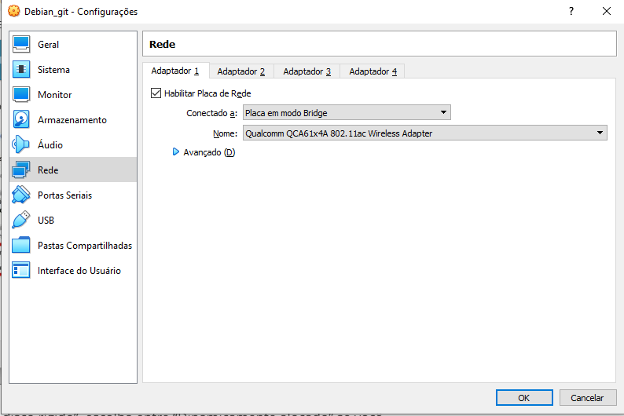
    <li>Ao ligar nossa VM podemos selecionar nossa <strong>Debian Iso </strong> para instalação.</li>
    <li>É importante que selecionemos a instalação sem a interface grafica.</li>
    <li>A primeira parte da instalação é bastante simples, basta selecionar a linguagem e a localização,hostname (login da intra + 42), senha do root e usuario inicial.</li>
    <li>Depois das configurações basicas iremos definir como nossas partições serão organizadas.</li>
    <li>Basta selecionar a opção para setar o lvm encriptado automaticamente.</li>
    <li>Iremos criar algumas pastas em partições separadas.</li>
    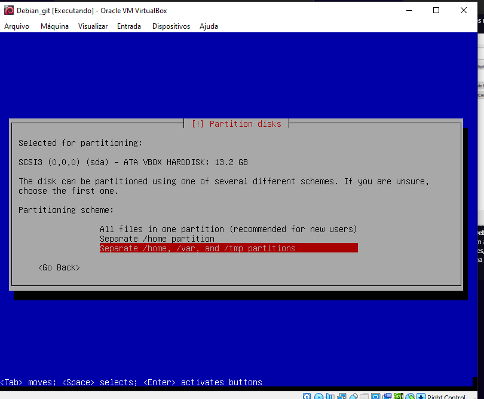
    <li>Agora basta esperar a instalação.</li>
    <li>Irei deixar apenas os sofwares padrões e o ssh como programas iniciais.</li>
    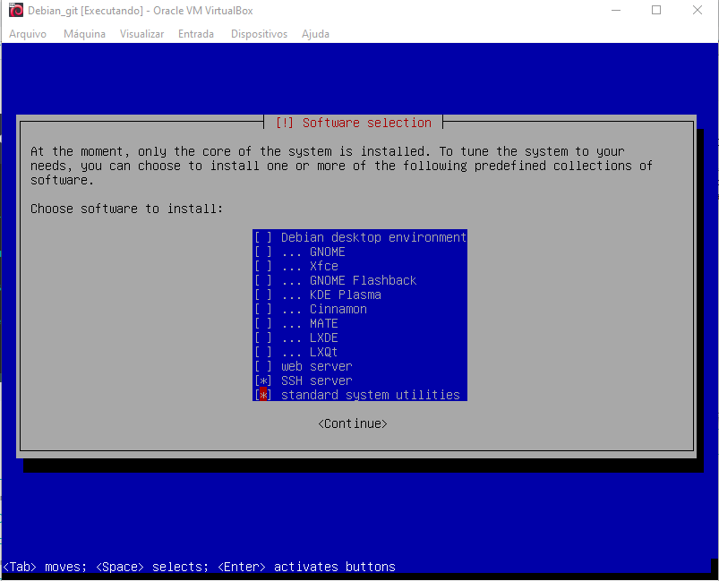
</ul>
<h2>Configurações</h2>
<ul>
    <li>Durante A instalação desse servidor estarei utilizando o gerenciador de pacote aptitude, por se tratar uma aplicação mais simples</li>
    <li><strong>apt install aptitude</strong></li>
    <li>Vim como editor de texto.</li>
    <li><strong>aptitude install vim</strong></li>
    <li>App Armor é um software sutilizado para limitar o acesso dos programas a certos recursos.</li>
    <li>Podemos visualizar o apparmor com <strong>aa-status</strong>.</li>
    <li>Podemos verificar o hostname da nossa maquina com <strong>hostname</strong></li>
    <li>O hostname pode ser modificado com <strong>hostnamectl set-hostname "new host name"</strong></li>
</ul>

<h2>SSH</h2>
<ul>
    <li>O <a href="https://www.weblink.com.br/blog/tecnologia/acesso-ssh-o-que-e/" target="_blank" rel="noopener noreferrer">SSH</a> é um protolo de rede utilizado para acessar, gerenciar e modificar um servidor remotamente. </li>
    <li>Esse acesso é realizado atraves da rede, onde dados e informações são transmitidos atraves de uma comunicação criptografada.</li>
    <li>A ferramenta utilizada sera o <a href="https://www.cyberciti.biz/faq/ubuntu-linux-install-openssh-server/" target="_blank" rel="noopener noreferrer"> Open SSH</a></li>
    <li>Podemos verificar sua execução com o systemctl status ssh</li>
    <li>Por padrão ele estara rodando na porta 22</li>
    <li>Estarei mudando a porta no arquivo /etc/ssh/sshd_config com o vim</li>
    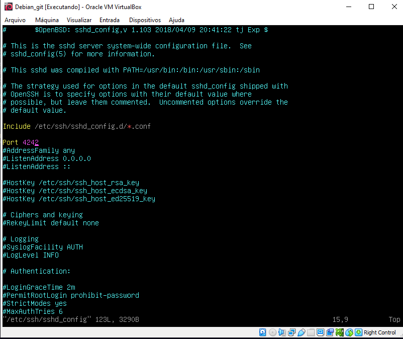
    <li>Agora computadores na mesma rede podem acessar nossa maquina via SSH</li>
    <li>A conexão é realizada com <strong>ssh user@host -p 4242</strong></li>
    <ol type="1">
        <li><strong>ssh</strong> é o comando utilizado para realizar nossa conexão.</li>
        <li><strong>user</strong> sera o usuario que tentaremos acessar na nossa maquina.</li>
        <li><strong>host</strong> sera o ip da nossa maquina</li>
        <li><strong>-p</strong> é utilizado para indicar a porta onde conexão sera estabelecida, em nosso caso a porta 4242</li>
    </ol>
</ul>
<li>Para ver o ip da nossa maquina usamos <strong>ip -4 address</strong>, sera a numeração na frente do <strong>inet</strong> e atras do <strong>brd</strong></li>

<li>Logo para se conectar a nossa maquina precisamos do seguinte codigo: <strong>ssh flda-sil@10.0.0.110 -p 4242</strong></li>
<li>Ao executar o codigo de outra maquina (ou mesmo da local) sera pedido a senha do usuario estamos tentando se conectar.</li>
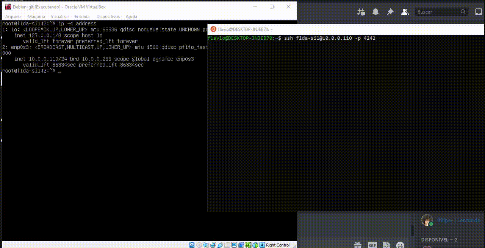
<li>Agora podemos navegar na nossa maquina remotamente.</li>
 
<h2>Firewall</h2>
<ul>
    <li>Estarei utilizando <a href="https://www.linode.com/docs/guides/configure-firewall-with-ufw/" target="_blank" rel="noopener noreferrer">UFW</a> como firewall.</li>
    <li>Ele é um firewall front-end descomplicado que nos permite o gerenciamento das regras do firewall.</li>
    <li>Foi criado para facilitar a configuração de um firewall.</li>
    <li>Para installar e ativar o ufw:</li>
    <ol type="1">
        <li><strong>aptitude install ufw</strong></li>
        <li><strong>ufw enable</strong> (para iniciar as regras)</li>
        <li><strong>systemctl enable ufw</strong> (para iniciar as regras sempre no boot)</li>
    </ol>
    <li>Iremos começar negando todas conexões recebidas e permitindo as saidas:</li>
    <ol type="1">
        <li><strong>ufw default allow outgoing</strong></li>
        <li><strong>ufw default deny incoming</strong></li>
    </ol>
    <li>Nesse ponto caso tentemos nos conectar via SSH como foi feito anteriormente, a conexão sera negada.</li>
    <li>Para resolver esse problema podemos permitir a porta na qual o SSH esta rodando (4242)</li>
    <ol type="1">
        <li><strong>ufw allow 4242</strong></li>
    </ol>
    <li>Da mesma forma podemos negar novamente esse porta</li>
    <ol type="1">
        <li><strong>ufw deny 4242</strong></li>
    </ol>
    <li><strong>ufw status</strong> podemos verificar nossas regras.</li>
</ul>

<h2>Password Policy</h2>
<ul>
    <li>Irei modificar algumas da <a href="https://ostechnix.com/how-to-set-password-policies-in-linux/" target="_blank" rel="noopener noreferrer">politiacas de segurança.</a></li>
    <li>Para as configurações iniciais estarei modificando o arquivo <strong>/etc/login.defs</strong> com o vim.</li>
    <li>Estarei deixando a expiração de uma senha para 30 dias, um warning 7 dias antes e a modificação de uma senha tem que ter o intervalo minimo de 2 dias.</li>
    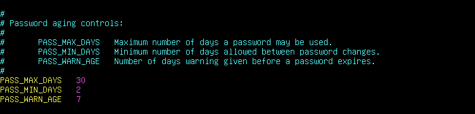
    <li>Essas configurações serão aplicadas apenas para os novos usuarios</li>
    <ul>
        <li>Para ver as configurações de expiração de senha para os usuarios ja criados usamos <strong>chage -l "username"</strong></li>
        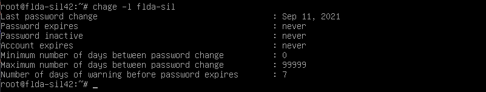
        <li>E para modificar os valores:</li>
        <li><strong>chage -M "days" "username"</strong> (Numero maximo de dias uma senha pode ser usada).</li>
        <li><strong>chage -m "days" "username"</strong> (Numero minimo de dias antes de uma senha ser trocada).</li>
        <li><strong>chage -W "days" "username"</strong> (Manda um warning antes da senha expirar).</li>
    </ul>
    <li>Para algumas configurações mais avançadas estarei utilizando o pwquality</li>
    <li><strong>aptitude install libpam-pwquality</strong></li>
    <li>Agora podemos adicionar <a href="https://manpages.debian.org/unstable/libpwquality-common/pwquality.conf.5.en.html" target="_blank" rel="noopener noreferrer">regras</a> mais avançadas no arquivo <strong>etc/pam.d/common-password</strong> </li>
    <li>Setarei um tamanho minimo de 10 characters, minimo de 1 letra maiuscula e 1 digito, maximo de 3 repetições do mesmo character, alem das configurações padrões do pwquality.</li>
    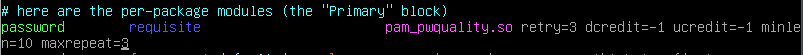
</ul>

<h2>Sudo</h2>
<ul>
    <li>O sistema bloqueia certos locais e ações por razões de segurança, o unico que pode acessar essas areas é o root user.</li>
    <li>Não é uma boa pratica utilizar o sistema sempre logado na conta root, pois podemos executar alguma ação não intencionada que pode dafinificar o sistema.</li>
    <li>Para resolver essas questões surgiu o <a href="https://phoenixnap.com/kb/linux-sudo-command" target="_blank" rel="noopener noreferrer">sudo</a> que nos permitira acesso temporario ao direitos de administrador mesmo não estando logado na conta root.</li>
    <li><strong>aptitude install sudo</strong></li>
    <li>Podemos verificar no arquivo <strong>/etc/sudoers</strong> que os usuarios que estiverem dentro do grupo <strong>sudo</strong> podera executar ações de administrador.</li>
    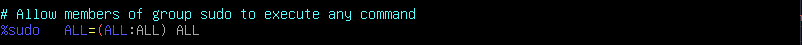
    <li>Para adicionar um usuario para esse grupo basta usar <strong>usermod -aG sudo "username"</strong>.</li>
    <li>Podemos acompanhar os comandos que os usuarios executaram com o sudo com <strong>grep sudo /var/log/auth.log</strong></li>
    <li>Estarei adicionando algumas configurações sobre o sudo</li>
    <ol type="1">
        <li><a href="https://www.tecmint.com/sudoers-configurations-for-setting-sudo-in-linux/" target="_blank" rel="noopener noreferrer">Configurações</a> podem ser adicionados no arquivo <strong>/etc/sudoers</strong></li>
        <li>Estarei modificando o numero maximo de tentativa ao errar a senha para executar um comando com sudo.</li>
        <li>Tambem colocarei uma mensagem costumizada caso o usuario erre a senha.</li>
        
    </ol>
    <li>Como citado anteriormente os logs do sudo estão presentes no <strong>/var/log/auth.log</strong>, mas esse arquivo tambem possui o logs de varias outras aplicações, logo é uma boa pratica ter um arquivo separado para o sudo.</li>
    <li>Para realizar tal ação, primeiro precisaremos adicionar a seguinte linha no arquivo <strong>/etc/sudoers</strong>:</li>
    
    <li>Depois precisaremos modificar o arquivo <strong>/etc/rsyslog.conf</strong> adicionando a seguinte linha:</li>
    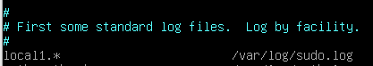
    <li>Agora reiniciaremos o serviço rsyslog, <strong>sudo systemctl restart rsyslog</strong></li>
    <li>Agora os logs relacionados ao sudo ficarão armazenados no arquivo <strong>/var/log/sudo.log</strong></li>
    <li>Por razões de segurança tambem esterei fazendo com que o sudo so possa ser usado com uma tty real, ou seja não pode ser executado por um cron por exemplo.</li>
    <li><strong>Defaults requiretty</strong> no <strong>/etc/sudoers</strong></li>
</ul>

<h2>Wordpress</h2>
<ul>
    <li>Agora é gora de montar nosso primeiro serviço do nosso servidor.</li>
    <li>Primeiro vamos installar o MariaDB como nosso banco de dados.</li>
    <li><strong>aptitude install mariadb-server mariadb-client</strong></li>
    <li>Podemos chegar se foi instalado com sucesso com o comando <strong>mysql</strong></li>
    <li>Agora precisaremos instalar o lighttpd</li>
    <li><strong>aptitude install <a href="https://www.rosehosting.com/blog/how-to-install-lighttpd-on-debian-9/" target="_blank" rel="noopener noreferrer">lighttpd</a></strong></li>
    <li>Podemos checar se esta rodando com <strong>systemctl status lighttpd</strong></li>
    <li>Podemos verifica suas configurações em <strong>/etc/lighttpd/lighttpd.conf</strong> e <strong>/etc/lighttpd/conf-available/</strong></li>
    <li>Agora caso coloquemos o ip da nossa maquina no browser uma pagina inicial sera mostrada</li>
    <li>O arquivo inicial do lighttpd esta localizado em <strong>/var/ww/html/</strong></li>
    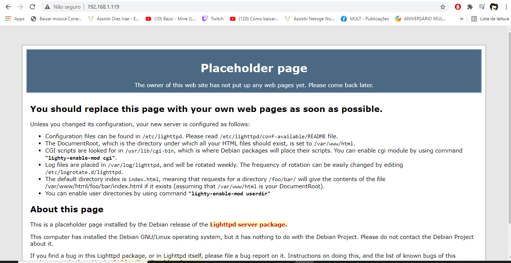
    <li>Agora iremos instalar o php para trabalhar junto com lighttpd</li>
    <li>Para installar o php assim como as extenções necessarias utilizamos <strong>aptitude install php php-cli php-common php-fpm php-mysql
    </strong></li>
    <li>Agora precisamos modificar o php.ini para habilitar o suporte do php pro lighttpd</li>
    <li><strong>vim /etc/php/"version"/fpm/php.ini</strong></li>
    <li>Primeiro iremos descomentar o comando <strong>cgi.fix_pathinfo=1</strong></li>
    <li>Por padrão o php-fpm escuta no socket /var/run/php7-fpm.sock, para mudar essa configuração padrão iremos alterar o arquivo /etc/php/"version"/fpm/pool.d/www.conf</li>
    <li>Na linha <strong>listen = /run/php/php7.0-fpm.sock</strong> iremos substituir por <strong>listen = 127.0.0.1:9000</strong></li>
    <li>Agora iremos habilitar o FastCgi modificando o arquivo <strong>/etc/lighttpd/conf-available/15-fastcgi-php.conf</strong></li>
    <li>nas linhas:  <strong>"bin-path" => "/usr/bin/php-cgi 
        "socket" => "/var/run/lighttpd/php.socket"</strong></li>
    <li>Colocaremos:  <strong>"host" => "127.0.0.1",  
        "port" => "9000",
       </strong></li>
    <li>Agora basta habilitar o FastCgi e FastCgi-php com:</li>
    <li><strong>lighty-enable-mod fastcgi</strong></li>
    <li><strong>lighty-enable-mod fastcgi-php</strong></li>
    <li>Agora iremos reiniciar os serviços:</li>
    <li>systemctl restart php7.0-fpm </li>
    <li>systemctl restart lighttpd</li>
    <li>Agora podemos testar subindo nosso primeiro site: <strong>(SEGUINTES PASSOS SÃO IRRELEVANTES PARA O PROJETO, JA QUE O VIRTUAL HOST SO SERIA ACESSIVEL DENTRO DA MAQUINA)</strong></li>
    <ul>
        <li>mkdir /var/www/html/testsite</li>
        <li>Agora criamos uma configuração para o nosso virtual host: <strong>vim /etc/lighttpd/conf-available/test.conf</strong></li>
        <li>Dentro dele colamos:</li>
        <li><strong>$HTTP["host"] =="test.example.com" {</strong></li>
        <li><strong>server.document-root = "/var/www/html/testsite"</strong></li>
        <li><strong>index-file.names = ( "index.php" )</strong></li>
        <li><strong>}</strong></li>
        <li>Agora ciramos um <strong>index.php</strong> dentro da pasta que criamos, essa sera nossa pagina inicial</li>
        <li>Dentro dela fiz um Hello World para testar</li>
        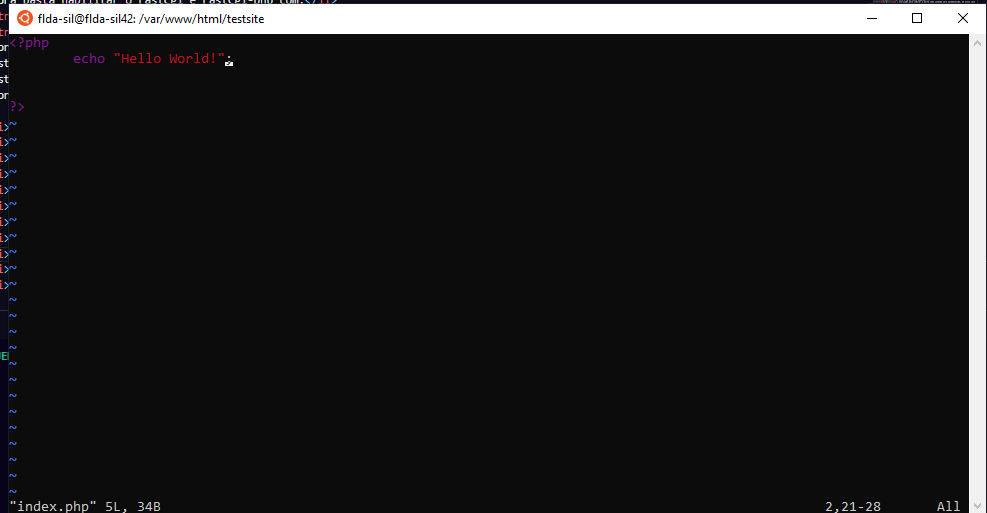
        <li>Agora podemos habilitar nosso virtual host com:</li>
        <li><strong>ln -s /etc/lighttpd/conf-available/test.conf /etc/lighttpd/conf-enabled/</strong></li>
        <li>Agora setamos as permisões apropriadas para a pasta do nosso site:</li>
        <li><strong>chown -R www-data:www-data /var/www/html/testsite</strong></li>
        <li>Finalmente reiniciamos nosso serviço: <strong>systemctl restart lighttpd</strong></li>
        <li>Agora caso tentemos acessar o host que configuramos (test.example.com) iremos ver o conteudo do nosso index.php</li>
    </ul>
    <li>Agora podemos criar nosso database para o nosso wordpress</li>
    <ul>
        <li><strong>mysql</strong></li>
        <li><strong>CREATE DATABASE wordpress;</strong></li>
        <li><strong>CREATE USER 'flda-sil'@'localhost' IDENTIFIED BY '123'</strong></li>
        <li><strong>GRANT ALL ON wordpress.* TO 'flda-sil'@'localhost';</strong></li>
        <li><strong>FLUSH PRIVILEGES</strong></li>
    </ul>
    <li>Com o database criado podemos ir na pasta <strong>/var/www/html/</strong> para setar nosso wordpress</li>
    <ul>
        <li>Primeiro apagaremos todos os arquivos da pasta: <strong>rm -fr /var/www/html/</strong></li>
        <li>Agora dentro da nossa pasta de downloads iremos baixar o wordpress: <strong>wget http://wordpress.org/latest.tar.gz</strong></li>
        <li>Podemos extrair seu conteudo com: <strong>tar xpf latest.tar.gz</strong></li>
        <li>Agora copiados todo conteudo da pasta <strong>wordpress</strong> que foi oque extraimos e colamos em <strong>/var/www/html</strong></li>
        <li><strong>sudo cp -r wordpress /var/www/html/</strong></li>
        <li>Agora setamos as permisões da pasta do nosso site:</li>
        <li><strong>sudo chown -R www-data:www-data /var/www/html</strong></li>
        <li><strong>sudo chmod -R 777 /var/www/html</strong></li>
    </ul>
    <li>Agora quando acessarmos o ip da nossa maquina no navegador conseguiremos nos conectar ao wordpress</li>
    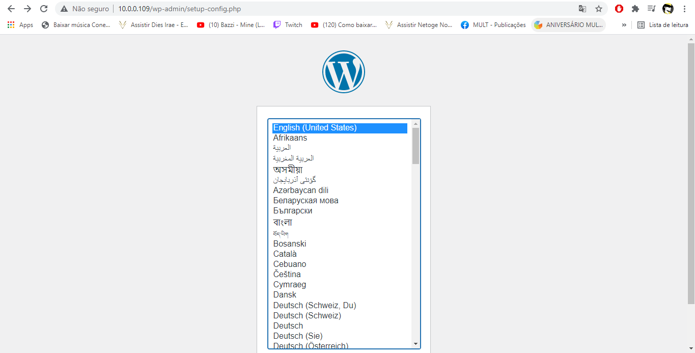
</ul>